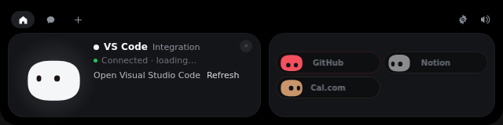

<div align="center">


# Coucou

**A tiny friend that lives at the top of your screen on Windows and Linux, and keeps an eye on your Claude Code sessions.**

Approve permissions, watch your agents work, drop a file, chat with Claude — all without leaving what you're doing.


</div>

---

## Why

Some studios showed off gorgeous desktop companions… and never let anyone use them.
**Coucou is the open version.** Every line of code, every animation, every sound — free to use, read, fork and remix.

Meet **Mochi**: a soft little squircle with big eyes that pops out of the top of your screen, waves hello, follows your cursor with its eyes, gets annoyed when you poke it (and dizzy if you insist), and tells you the moment Claude Code needs you.

## Features

- 🤖 **Claude Code, live** — see every session at the top of your screen: what it reads, edits and runs, step by step. Finished? Mochi does a happy little jump.
- ✅ **Approve from the island** — Claude Code permission requests show up with **Allow / Deny**. One click, back to work. Works from any terminal.
- 💬 **Ask Claude anything** — built-in chat, straight from the island.
- 📎 **Drop a file on the island** — Mochi turns into a box and swallows it, then ask a question about it.
- 🔌 **Integrations** — Stripe payments, n8n workflows, GitHub, Vercel deployments, Resend emails, Notion, Cal.com. Each one gets its own little colored Mochi.
- 🎭 **A real character** — idle breathing, blinks, eyes on a sphere that follow your mouse, emotes, 28 handcrafted sounds, a greeting on launch.
- 🫥 **Invisible when idle** — retracts into the top edge of the screen when nothing is running, peeks out when you hover it.
- 🔒 **Private by design** — no telemetry, no account. Keys live in the Windows Credential Manager or the Linux Secret Service. The app only talks to the services you plug in.

<table>
<tr>
<td></td>
<td></td>
</tr>
<tr>
<td></td>
<td></td>
</tr>
</table>

## Install

### Linux

Built and tested for Arch. On Arch:

```bash
git clone https://github.com/jesus13g/coucou.git
cd coucou/windows/linux
makepkg -si
```

Requirements, Wayland notes (it runs through XWayland), tray and keyring setup
are in [`windows/LINUX.md`](windows/LINUX.md).

### Windows

There is no published installer for now: Microsoft Defender wrongly flags the
unsigned installer as malware. [Build it from source](#build-from-source); it
takes a few minutes and installs for the current user only. See
[`windows/README.md`](windows/README.md) for details.

### Build from source

The app lives in [`windows/`](windows/) — a [Tauri 2](https://tauri.app) app whose
sources build on both Windows and Linux.

**Windows** — requirements: [Rust](https://rustup.rs), Node 20+, MSVC build tools.

```powershell
git clone https://github.com/jesus13g/coucou.git
cd coucou/windows
npm install
npm run pack                # installer lands in windows/release/
```

**Linux** — requirements: Rust, Node 20+, WebKitGTK 4.1, libayatana-appindicator
(see [`windows/LINUX.md`](windows/LINUX.md)).

```bash
cd coucou/windows
npm install
npm run pack                # .deb / .rpm / .AppImage land in windows/release/
```

## Setup

Click the Coucou icon in the system tray → **Settings…**

| What | Why | Where the key goes |
|---|---|---|
| **Claude Code hooks** | live sessions and approvals | **Install hooks** — Coucou backs up `~/.claude/settings.json`, merges its hooks and shows you the diff before writing anything |
| **Anthropic API key** | chat and questions about files | Windows Credential Manager / Linux Secret Service |
| Stripe, n8n, GitHub, Vercel, Resend, Notion, Cal.com | the integration pills | Windows Credential Manager / Linux Secret Service, all optional |

If Coucou isn't running, the hook exits immediately: **Claude Code is never blocked.**

## Things to try

| Do this | Mochi does that |
|---|---|
| Move the mouse to the top centre of the screen | peeks out and says hi 👋 |
| Click it | opens |
| Hover Mochi | blinks, eyes grow |
| Click Mochi | squish + annoyed |
| Click 3 times fast | 😵‍💫 dizzy for a few seconds |
| Drag a file onto the island | turns into a box and swallows it |
| `Esc` | closes the island |

## How it works

- **App**: a [Tauri 2](https://tauri.app) app (Rust + TypeScript). The island is a transparent, always-on-top window that never steals focus, driven by a small state machine (`hidden → compact → expanded`).
- **Character**: drawn in Canvas 2D at 60 fps — squircle body, eyes projected on a sphere, spring animations. No Rive, no Lottie, no images.
- **Claude Code**: a tiny `coucou-hook` relay receives hook events and forwards them to the app — over a named pipe on Windows, over a private Unix socket in `/run/user/<uid>/coucou/` on Linux. For approvals it waits for your click, then answers the hook.
- **Integrations**: lightweight pollers, paused when nothing is watching.
- **Sounds**: 28 short WAVs played through Web Audio.
- **Linux specifics**: built against WebKitGTK; the island is an X11 utility window (through XWayland on Wayland sessions) tuned through GTK, and the cursor is read with `XQueryPointer`. Details in [`windows/LINUX.md`](windows/LINUX.md).
- **Windows specifics**: WebView2, Win32 window styles, Credential Manager. Details in [`windows/README.md`](windows/README.md).

## Contributing

Issues and PRs are very welcome — new integrations, new emotes, new sounds, bug fixes. See [CONTRIBUTING.md](CONTRIBUTING.md).

## Credits

Built by [Louis Raillé](https://louisraille.fr) with Claude Code.
Inspired by the desktop-companion concepts shared by design studios — this project is independent and not affiliated with any of them.

## License

- **Code:** [MIT](LICENSE) — use it, fork it, learn from it, just keep the copyright notice.
- **Name, Mochi character, icon, sounds and media:** © Louis Raillé, all rights reserved — see [LICENSE-ASSETS.md](LICENSE-ASSETS.md). Shipping your own fork? Give it your own name and character.
